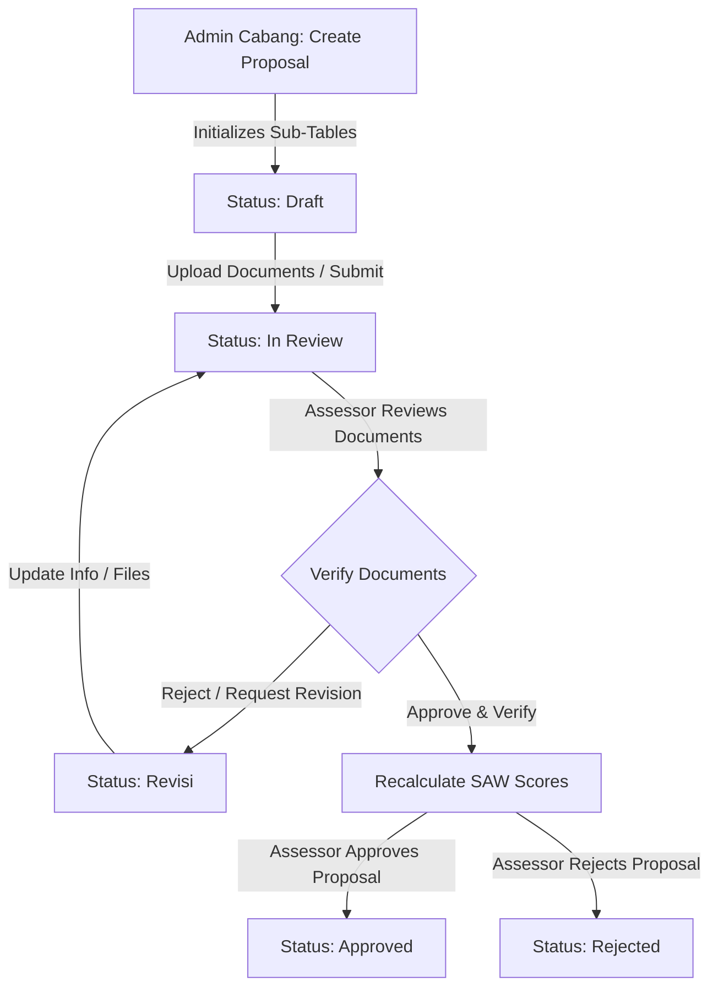
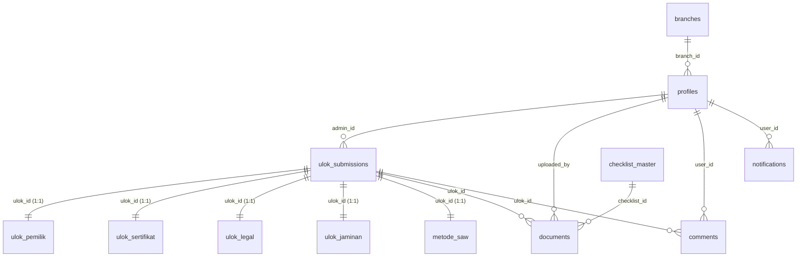

# PRIOLO (Prioritizing Location) - ULOK Assessment System

## Project Overview & Deployment
This application is a comprehensive web-based decision support system designed to manage and assess location proposals (*Usulan Lokasi* or **ULOK**) for **PT. Midi Utama Indonesia Tbk (Alfamidi)**. It bridges the gap between digitalizing legal documentation and calculating location feasibility for store expansions.

The platform provides role-based access control (RBAC), customized workflows for Branch Admins, Legal Assessors, and Super Admins, and implements the **Simple Additive Weighting (SAW)** method to automatically rank and evaluate location proposals.

This project is deployed on Vercel:
*   **Production Live Link**: [https://capstone-ulok.vercel.app](https://capstone-ulok.vercel.app)
*   **Preview Branch Link**: [https://capstone-ulok-r1w6swosk-ernandarevalinos-projects.vercel.app](https://capstone-ulok-r1w6swosk-ernandarevalinos-projects.vercel.app)

---

## Core Features & Workflows

### 1. Proposal Lifecycle
A location proposal moves through several key statuses in its lifecycle:



*   **Draft**: The proposal is created by a Branch Admin. It is only editable by its creator and is not yet visible in the Assessor's validation queues.
*   **In Review**: The Branch Admin uploads documents and submits the proposal. The system sets the timestamp `first_in_review_at` and makes the proposal visible in the Assessor's validation panel.
*   **Revisi**: The Assessor rejects one or more documents or requires adjustments, sending the proposal back to the Branch Admin.
*   **Approved**: The Assessor validates all mandatory legal documents, which calculates the final SAW score and timestamps `approved_at`.
*   **Rejected**: The proposal is marked as rejected by the Assessor (e.g., due to critical legal flaws or excessive costs).

### 2. Auto-Initialization of 5 Sub-Tables
When a proposal is successfully created via `createUlokSubmission`, the system automatically inserts empty placeholder rows in **five secondary tables** to maintain a clean 1:1 relationship database structure and prevent null reference errors on subsequent edits:
1.  `ulok_pemilik` (Owner Identities and identification fields)
2.  `ulok_sertifikat` (Land Certificate details and process records)
3.  `ulok_legal` (AJB details and subdistrict letters)
4.  `ulok_jaminan` (Bank Guarantee descriptions)
5.  `metode_saw` (SAW metrics, scores, and auto-generated audit notes)

### 3. Queue Partitioning & Grouping (Antrean Aktif)
Proposals in the assessment phase are automatically grouped into distinct queues to streamline the Assessor's workflow:
*   **Antrean Aktif**: Contains all proposals with status `'In Review'`. Under active evaluation.
*   **Patut Dilihat (Smart Filter / High Potential)**: A subset of `In Review` proposals automatically recommended by a rule-based algorithm when:
    *   Document upload progress ($\ge 50\%$)
    *   Harga Sewa ($\le 350,000,000$ IDR)
    *   Has uploaded core title documents (either `sertifikat_tanah` or `ajb_girik`)
*   **Perlu Revisi**: Contains all proposals with status `'Revisi'` that require active correction by the branches.
*   **Selesai Dinilai**: Contains all proposals with status `'Approved'` or `'Rejected'`, showing their final computed SAW ranking score.

> [!NOTE]
> *Legacy Mapping Note*: In earlier system designs, queues were referred to as **Kelompok 1** (Draft/Low progress), **Kelompok 2** (Active Verification), **Kelompok 3** (Revision), and **Kelompok 4** (Approved/100% complete). The current codebase implements this mapping dynamically across the four groups above, keeping Drafts excluded from Assessor lists to optimize focus.

---

## Decision Support Engine (SAW Method)

The platform evaluates proposals mathematically using the **Simple Additive Weighting (SAW)** algorithm.

### 1. Mathematical Formula
For a given proposal, the normalized scores $R_{Cj}$ for each criterion $C_j$ are calculated by dividing the score by the maximum scale (which is $5$):

$$R_{C1} = \frac{C_1}{5}, \quad R_{C2} = \frac{C_2}{5}, \quad R_{C3} = \frac{C_3}{5}$$

The final evaluation score is calculated as a weighted sum:

$$\text{Final Score} = (0.45 \times R_{C1}) + (0.35 \times R_{C2}) + (0.20 \times R_{C3})$$

### 2. Scoring Criteria & Indicators

#### C1: Kelengkapan Dokumen (Weight: 45%) - Benefit
Measures the percentage of verified required documents against the checklist dynamically determined by the submitter's legal entity type (*Jenis Badan Hukum*):

$$pct = \frac{\text{Unique Uploaded Documents Verified}}{\text{Total Required Documents}} \times 100$$

The scoring scale is defined as:
*   $80\% \le pct \le 100\%$: **Score 5**
*   $60\% \le pct < 80\%$: **Score 4**
*   $40\% \le pct < 60\%$: **Score 3**
*   $20\% \le pct < 40\%$: **Score 2**
*   $0\% \le pct < 20\%$: **Score 1**

##### Dynamic Checklist Determination Rules:
*   **PT**: Base checklist of 11 documents. If "Dikuasakan" is checked, `checklist_id: 10` is appended. If RUPS exists, `checklist_id: 11` is appended. If `sertifikat_tanah` is chosen, `checklist_id: 12` is appended; otherwise, `checklist_id: 13` (AJB/Girik) is appended. If `slf` exists, `checklist_id: 16` is appended.
*   **Yayasan**: Base checklist of 10 documents. Dynamic inclusions: `checklist_id: 25` (if Dikuasakan), `checklist_id: 26` (Sertifikat) or `27` (AJB), `checklist_id: 30` (SLF).
*   **Koperasi**: Base checklist of 10 documents. Dynamic inclusions: `checklist_id: 39` (if Dikuasakan), `checklist_id: 40` (Sertifikat) or `41` (AJB), `checklist_id: 44` (SLF).
*   **Perorangan / Kuasa / Waris / Hibah**: Base checklist of 5 documents.
    *   If WNA (KITAS/KITAP): Includes `checklist_id: 46` (WNA), else `45` (KTP Pemilik).
    *   If Married: Includes `50` (Buku Nikah) and `51` (Persetujuan Pasangan). If Divorced: Includes `53` (Akta Cerai).
    *   If Change of Name: Includes `52`.
    *   If `Kuasa`: Includes `59` (Akta Kuasa) and `60` (KTP Penerima Kuasa).
    *   If `Waris`: Includes `61` (Akta Waris), `62` (Surat Kematian), `63` (KTP Ahli Waris), `64` (KK Ahli Waris) and filters out `45`.
    *   If `Hibah`: Includes `65` (Akta Hibah).
    *   If Sertifikat is chosen, `checklist_id: 54` is included; otherwise, `55` (AJB/Girik). If `slf` is uploaded, `58` is included.

#### C2: Durasi Mobilisasi (Weight: 35%) - Cost
Measures the duration (in days) from the first submission timestamp (`first_in_review_at`) to approval (`approved_at`). This is computed only for proposals that reach `Approved` status:

$$\text{Duration} = \lfloor \frac{\text{approved\_at} - \text{first\_in\_review\_at}}{86,400,000 \text{ ms}} \rfloor$$

The scoring scale is defined as:
*   Duration $< 5$ days: **Score 5**
*   $5 \le \text{Duration} \le 12$ days: **Score 4**
*   $12 < \text{Duration} \le 20$ days: **Score 3**
*   $20 < \text{Duration} \le 30$ days: **Score 2**
*   Duration $> 30$ days (or status not yet Approved): **Score 1**

#### C3: Harga Sewa (Weight: 20%) - Cost
Measures the cost-efficiency of the total 5-year lease value submitted:
*   Lease $< 250,000,000$ IDR: **Score 5**
*   $250,000,000 \le \text{Lease} \le 350,000,000$ IDR: **Score 4**
*   $350,000,000 < \text{Lease} \le 450,000,000$ IDR: **Score 3**
*   $450,000,000 < \text{Lease} \le 550,000,000$ IDR: **Score 2**
*   Lease $> 550,000,000$ IDR (or 0 / null): **Score 1**

### 3. Recommendation Categories
*   **Final Score $\ge 0.75$**: Primary Recommendation (*Rekomendasi Utama*). The proposal has robust document completion, low cost, or rapid approval times.
*   **Final Score $< 0.75$**: Warning Category. Warns of legal bottlenecks (low C1), excessive timeline delay risks (low C2), or high financial burden (low C3).

---

## Tech Stack & Dependencies
*   **Frontend Core**: Next.js v16.2.6 (React 19 App Router, HTML5, TypeScript v5.9.3)
*   **Styling**: Tailwind CSS v4.3.0, @tailwindcss/postcss v4.3.0
*   **Backend & DB**: Supabase (PostgreSQL database, Supabase Auth, Storage Buckets)
*   **Integration clients**: `@supabase/supabase-js` v2.105.4, `@supabase/ssr` v0.10.3
*   **Libraries**:
    *   `lucide-react` v1.16.0 (Custom Interface Icons)
    *   `recharts` v3.8.1 (Analytical statistics graphs)
    *   `next-themes` v0.4.6 (Dark & light mode theme engine support)

---

## Project Architecture & Folder Structure
```
├── actions/               # Server Actions for backend logic and database query operations
│   ├── assessor.ts        # Assessor operations (verification, status updates, history)
│   ├── auth.ts            # Authentication flows (login, session, profile queries, avatar update)
│   ├── cabang.ts          # Branch Admin flows (submitting, updating sub-table data, uploading files)
│   ├── pengelompokan.ts   # Queue grouping logic (Active, Smart Filter, Revision, Completed)
│   ├── saw.ts             # Simple Additive Weighting (SAW) algorithm and scoring logic
│   └── superadmin.ts      # Super Admin management (user creation, branch setup, global notifications)
├── app/                   # Next.js App Router folders
│   ├── admin/             # Role-specific layouts & dashboards
│   │   ├── assessor/      # Assessor views, verification panels, and history lists
│   │   │   ├── histori/        # Evaluation history page
│   │   │   ├── notification/   # Notification panel for assessors
│   │   │   ├── pengelompokan/  # Grouped queue dashboard
│   │   │   ├── penilaian/      # Assessment details (ulok-badanhukum & ulok-perorangan)
│   │   │   ├── peringkat/      # SAW leaderboard view
│   │   │   └── profile/        # Assessor profile page
│   │   ├── cabang/        # Branch Admin dashboards & profile
│   │   │   ├── feedback/       # Feedback comments page
│   │   │   ├── notification/   # Branch notification center
│   │   │   ├── peringkat/      # SAW leaderboard view for branches
│   │   │   ├── profile/        # Branch profile page
│   │   │   └── usulan-lokasi/  # Location submission forms and dashboard
│   │   └── super-admin/   # Super Admin dashboard
│   │       ├── daftaruser/     # User list & role management
│   │       ├── notification/   # Notification center
│   │       └── profile/        # Super Admin profile page
│   ├── login/             # Authentication interface
│   ├── globals.css        # Tailwind directives and CSS definitions
│   ├── layout.tsx         # Root document template
│   └── page.tsx           # Welcome landing page (PRIOLO Landing)
├── components/            # Reusable UI component modules
│   ├── assessor/          # Assessor-specific headers (desktop/mobile)
│   ├── cabang/            # Branch-specific headers (desktop/mobile)
│   ├── super-admin/       # Super Admin headers (desktop/mobile)
│   ├── floating-controls.tsx # Theme toggles and floating UI buttons
│   ├── footer_global.tsx  # Shared footer
│   ├── profile_global.tsx # Global profile details panel
│   └── theme-provider.tsx # Theme controller (light/dark toggle)
├── lib/                   # Supabase clients and helper libs
│   └── supabaseClient.ts  # Client-side Supabase client configuration
├── public/                # Static assets, SVG files, and icons
└── utils/                 # Utilities and helper scripts
    ├── progress.ts        # Progress calculation logic (numerator, denominator, percentages)
    └── supabase/
        └── server.ts      # SSR server action Supabase client utility
```

---

## Database Schema & Relationship

### 1. Entity Relationship Diagram (ERD)



### 2. Complete Supabase PostgreSQL DDL Setup
Execute the following DDL script in your Supabase SQL Editor to construct the schema, relations, and primary constraints accurately:

```sql
-- 1. Branches Table
CREATE TABLE public.branches (
  id integer NOT NULL GENERATED BY DEFAULT AS IDENTITY,
  nama_cabang character varying NOT NULL,
  kabupaten_kota character varying NOT NULL,
  provinsi character varying NOT NULL,
  created_at timestamp with time zone NOT NULL DEFAULT timezone('utc'::text, now()),
  CONSTRAINT branches_pkey PRIMARY KEY (id)
);

-- 2. User Profiles Table
CREATE TABLE public.profiles (
  id uuid NOT NULL,
  full_name text NOT NULL,
  nik text NOT NULL UNIQUE,
  role character varying NOT NULL DEFAULT 'admin_cabang'::character varying, -- super_admin, admin_cabang, assessor
  avatar_url text,
  branch_id integer,
  created_at timestamp with time zone NOT NULL DEFAULT timezone('utc'::text, now()),
  CONSTRAINT profiles_pkey PRIMARY KEY (id),
  CONSTRAINT profiles_id_fkey FOREIGN KEY (id) REFERENCES auth.users(id) ON DELETE CASCADE,
  CONSTRAINT profiles_branch_id_fkey FOREIGN KEY (branch_id) REFERENCES public.branches(id) ON DELETE SET NULL
);

-- 3. Main Proposals Submissions Table
CREATE TABLE public.ulok_submissions (
  id uuid NOT NULL DEFAULT gen_random_uuid(),
  admin_id uuid NOT NULL,
  nama_lokasi character varying NOT NULL,
  alamat_koordinat text,
  detail_alamat text,
  jenis_badan_hukum character varying NOT NULL,
  nama_pemegang_hak character varying NOT NULL,
  harga_sewa double precision DEFAULT 0,
  status character varying NOT NULL DEFAULT 'Draft'::character varying, -- Draft, In Review, Revisi, Approved, Rejected
  updated_by uuid,
  created_at timestamp with time zone NOT NULL DEFAULT timezone('utc'::text, now()),
  updated_at timestamp with time zone NOT NULL DEFAULT timezone('utc'::text, now()),
  first_in_review_at timestamp with time zone,
  approved_at timestamp with time zone,
  documents_completed_at timestamp with time zone,
  last_reviewed_at timestamp with time zone,
  CONSTRAINT ulok_submissions_pkey PRIMARY KEY (id),
  CONSTRAINT ulok_submissions_admin_id_fkey FOREIGN KEY (admin_id) REFERENCES public.profiles(id) ON DELETE CASCADE,
  CONSTRAINT ulok_submissions_updated_by_fkey FOREIGN KEY (updated_by) REFERENCES public.profiles(id) ON DELETE SET NULL
);

-- 4. Owner Information Sub-Table (1:1)
CREATE TABLE public.ulok_pemilik (
  ulok_id uuid NOT NULL,
  jenis_identitas character varying DEFAULT 'E-KTP'::character varying,
  nik_pemilik character varying,
  nama_kitas character varying,
  no_kk character varying,
  no_buku_nikah character varying,
  nama_sebelum_ganti character varying,
  nama_sesudah_ganti character varying,
  no_surat_kematian character varying,
  bentuk_objek character varying,
  data_pribadi_lainnya text,
  CONSTRAINT ulok_pemilik_pkey PRIMARY KEY (ulok_id),
  CONSTRAINT ulok_pemilik_ulok_id_fkey FOREIGN KEY (ulok_id) REFERENCES public.ulok_submissions(id) ON DELETE CASCADE
);

-- 5. Land Certificate Details Sub-Table (1:1)
CREATE TABLE public.ulok_sertifikat (
  ulok_id uuid NOT NULL,
  jenis_alas_hak character varying,
  no_sertifikat_alas_hak character varying,
  nama_sertifikat character varying,
  luas_sertifikat double precision,
  masa_berlaku date,
  tanggal_proses date,
  CONSTRAINT ulok_sertifikat_pkey PRIMARY KEY (ulok_id),
  CONSTRAINT ulok_sertifikat_ulok_id_fkey FOREIGN KEY (ulok_id) REFERENCES public.ulok_submissions(id) ON DELETE CASCADE
);

-- 6. Legal / AJB Details Sub-Table (1:1)
CREATE TABLE public.ulok_legal (
  ulok_id uuid NOT NULL,
  no_ajb_lainnya character varying,
  nama_ajb character varying,
  luas_ajb character varying,
  no_surat_kelurahan character varying,
  tanggal_surat_kelurahan date,
  CONSTRAINT ulok_legal_pkey PRIMARY KEY (ulok_id),
  CONSTRAINT ulok_legal_ulok_id_fkey FOREIGN KEY (ulok_id) REFERENCES public.ulok_submissions(id) ON DELETE CASCADE
);

-- 7. Guarantee / Jaminan Details Sub-Table (1:1)
CREATE TABLE public.ulok_jaminan (
  ulok_id uuid NOT NULL,
  nama_jaminan character varying,
  no_surat_jaminan character varying,
  tanggal_jaminan date,
  dokumen_jaminan boolean DEFAULT false,
  CONSTRAINT ulok_jaminan_pkey PRIMARY KEY (ulok_id),
  CONSTRAINT ulok_jaminan_ulok_id_fkey FOREIGN KEY (ulok_id) REFERENCES public.ulok_submissions(id) ON DELETE CASCADE
);

-- 8. SAW Evaluation Parameters Sub-Table (1:1)
CREATE TABLE public.metode_saw (
  ulok_id uuid NOT NULL,
  c1_score integer DEFAULT 1,
  c2_score integer DEFAULT 1,
  c3_score integer DEFAULT 1,
  final_score double precision DEFAULT 0.0,
  saw_analysis_notes text,
  CONSTRAINT metode_saw_pkey PRIMARY KEY (ulok_id),
  CONSTRAINT metode_saw_ulok_id_fkey FOREIGN KEY (ulok_id) REFERENCES public.ulok_submissions(id) ON DELETE CASCADE
);

-- 9. Document Checklists Master Table
CREATE TABLE public.checklist_master (
  id integer NOT NULL GENERATED BY DEFAULT AS IDENTITY,
  jenis_badan_hukum character varying NOT NULL,
  nama_dokumen character varying NOT NULL,
  is_negotiable boolean DEFAULT false,
  CONSTRAINT checklist_master_pkey PRIMARY KEY (id)
);

-- 10. Documents Records Table
CREATE TABLE public.documents (
  id uuid NOT NULL DEFAULT gen_random_uuid(),
  ulok_id uuid NOT NULL,
  checklist_id integer,
  uploaded_by uuid NOT NULL,
  file_url text NOT NULL,
  document_type character varying,
  is_verified boolean DEFAULT false,
  uploaded_at timestamp with time zone NOT NULL DEFAULT timezone('utc'::text, now()),
  CONSTRAINT documents_pkey PRIMARY KEY (id),
  CONSTRAINT documents_ulok_id_fkey FOREIGN KEY (ulok_id) REFERENCES public.ulok_submissions(id) ON DELETE CASCADE,
  CONSTRAINT documents_checklist_id_fkey FOREIGN KEY (checklist_id) REFERENCES public.checklist_master(id) ON DELETE SET NULL,
  CONSTRAINT documents_uploaded_by_fkey FOREIGN KEY (uploaded_by) REFERENCES public.profiles(id) ON DELETE CASCADE
);

-- 11. Comments Discussion Table
CREATE TABLE public.comments (
  id uuid NOT NULL DEFAULT gen_random_uuid(),
  ulok_id uuid NOT NULL,
  user_id uuid NOT NULL,
  message text NOT NULL,
  created_at timestamp with time zone NOT NULL DEFAULT timezone('utc'::text, now()),
  CONSTRAINT comments_pkey PRIMARY KEY (id),
  CONSTRAINT comments_ulok_id_fkey FOREIGN KEY (ulok_id) REFERENCES public.ulok_submissions(id) ON DELETE CASCADE,
  CONSTRAINT comments_user_id_fkey FOREIGN KEY (user_id) REFERENCES public.profiles(id) ON DELETE CASCADE
);

-- 12. Real-time Notifications Table
CREATE TABLE public.notifications (
  id bigint GENERATED ALWAYS AS IDENTITY NOT NULL,
  user_id uuid,
  title character varying NOT NULL,
  message text NOT NULL,
  category character varying NOT NULL DEFAULT 'system'::character varying,
  is_read boolean DEFAULT false,
  created_at timestamp with time zone DEFAULT now(),
  CONSTRAINT notifications_pkey PRIMARY KEY (id),
  CONSTRAINT notifications_user_id_fkey FOREIGN KEY (user_id) REFERENCES public.profiles(id) ON DELETE CASCADE
);
```

---

## Environment Variables & Local Setup

### 1. Environment Configuration
Create a `.env.local` file in the root directory:

```env
NEXT_PUBLIC_SUPABASE_URL=https://your-project-id.supabase.co
NEXT_PUBLIC_SUPABASE_ANON_KEY=your-public-anon-key
SUPABASE_SERVICE_ROLE_KEY=your-powerful-service-role-key
```

*   `NEXT_PUBLIC_SUPABASE_URL`: Found under Project Settings > API in your Supabase dashboard.
*   `NEXT_PUBLIC_SUPABASE_ANON_KEY`: Client-side key for standard access.
*   `SUPABASE_SERVICE_ROLE_KEY`: Service-role key used for administrative actions (e.g. creating/managing users from Next.js server actions via `auth.admin`). **Never expose this key on the client side.**

### 2. Supabase Storage Buckets Setup
Ensure the following storage buckets are created and configured in your Supabase dashboard:
1.  `avatars`: Publicly accessible bucket for profile pictures.
2.  `dokumen-ulok`: Secured bucket for location proposal legal documents.

### 3. Local Installation & Launch
This project uses `pnpm` as its package manager. Follow these steps to run locally:

```bash
# 1. Install dependencies
pnpm install

# 2. Run the development server
pnpm run dev
```

The application runs by default on [http://localhost:3000](http://localhost:3000).

```bash
# 3. Build for production
pnpm run build

# 4. Start the production server
pnpm run start
```
