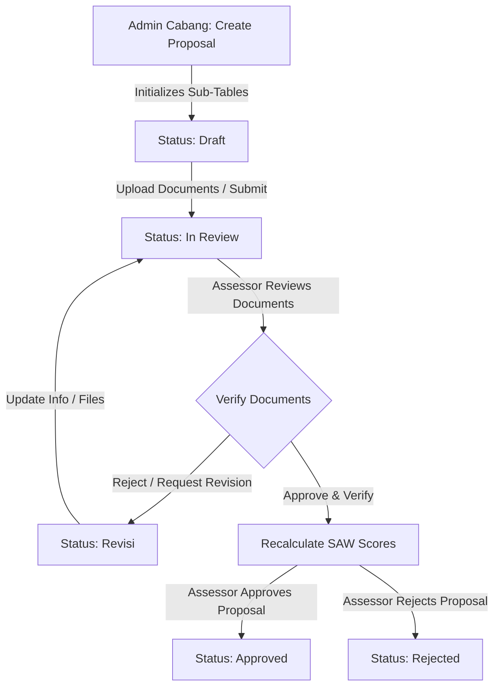
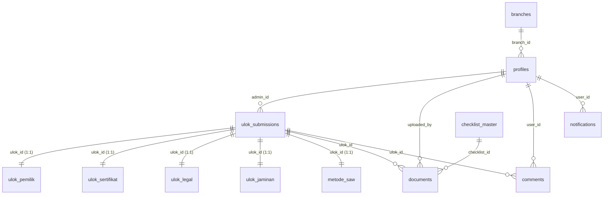

# ULOK (Usulan Lokasi) Assessment System

## Project Overview
This application is a comprehensive web-based system designed to manage and assess location proposals (*Usulan Lokasi* or **ULOK**) for **PT. Midi Utama Indonesia Tbk (Alfamidi)**. It provides a structured workflow for submitting, reviewing, and evaluating potential store locations, utilizing the **Simple Additive Weighting (SAW)** method for decision support. 

With role-based access control and a normalized database design, the system manages the entire lifecycle of a location proposal—from the initial draft submission by branches, legal document uploads, and verification by assessors, to final automated evaluations and administrative sign-offs.

---

## Features
- **Role-Based Authentication & Authorization**: Distinct access controls and custom dashboards for **Super Admin**, **Admin Cabang**, and **Assessor** roles.
- **Normalized Proposal Lifecycle**: Proposal data is cleanly distributed across specialized tables (owner details, certificates, legal AJB, and guarantees) linked dynamically via 1:1 relationships.
- **Dynamic Checklist System**: Checks required documents according to the submitter's legal entity type (*Jenis Badan Hukum*: PT, Yayasan, Koperasi, Perorangan, Kuasa, Waris, or Hibah).
- **Document Management**: Supabase-backed secure storage (`dokumen-ulok` bucket) for uploading, deleting, and verifying required legal files.
- **Real-Time Notification System**: Triggers notifications for status changes, comments/feedbacks, and new accounts.
- **SAW Decision Support**: Computes location suitability scores instantly using:
  - **C1: Kelengkapan Dokumen (45%)** — Verified files vs. required checklist.
  - **C2: Durasi Mobilisasi (35%)** — Review speed from initial review to approval.
  - **C3: Harga Sewa (20%)** — Cost efficiency of the 5-year rental price.
- **Submission Grouping (Antrean)**: Submissions are automatically grouped into 4 functional queues (Kelompok 1: New/Low Progress, Kelompok 2: Active Verification, Kelompok 3: Revision, Kelompok 4: Final/Approved).
- **Comprehensive User & Branch Management**: Super Admin controls branch configurations and staff accounts.

---

## Tech Stack
- **Framework**: Next.js 16.2.6 (React 19 App Router)
- **Styling**: Tailwind CSS v4.3.0 & PostCSS
- **Backend & Database**: Supabase (PostgreSQL, Supabase Auth, Storage Buckets)
- **Server Actions**: Native Next.js Server Actions for operations and state validation
- **Decision Engine**: Custom SAW weight-calculation services
- **UI & Visualization**: Recharts v3.8.1 (Leaderboard analysis charts) & Lucide React v1.16.0 (Icons)
- **Language**: TypeScript v5.9.3

---

## Folder Structure
Unlike legacy structures, all code modules are hosted directly at the root of the project:
```
├── actions/               # Server Actions for backend logic and database query operations
│   ├── assessor.ts        # Assessor operations (verification, status updates)
│   ├── auth.ts            # Authentication flows (login, session, profile queries)
│   ├── cabang.ts          # Branch Admin flows (submitting, updating sub-table data)
│   ├── pengelompokan.ts   # Queue grouping logic (Kelompok 1, 2, 3, 4)
│   ├── saw.ts             # Simple Additive Weighting (SAW) algorithm and scoring logic
│   └── superadmin.ts      # Super Admin management (user creation, branch setup, global alerts)
├── app/                   # Next.js App Router folders
│   ├── admin/             # Role-specific layouts & dashboards
│   │   ├── assessor/      # Assessor views, verification panels, and history lists
│   │   ├── cabang/        # Location submission forms, detail views, and comments
│   │   └── super-admin/   # Admin management, branch metrics, and notifications
│   ├── login/             # Authentication interface
│   ├── globals.css        # Tailwind directives and CSS definitions
│   ├── layout.tsx         # Root document template
│   └── page.tsx           # Dashboard landing entry route
├── components/            # Reusable UI component modules
│   ├── assessor/          # Assessor-specific components
│   ├── cabang/            # Branch-specific components
│   ├── super-admin/       # Admin-specific components
│   ├── floating-controls.tsx # Floating UI tools
│   ├── footer_global.tsx  # Shared footer
│   ├── profile_global.tsx # Global profile details panel
│   └── theme-provider.tsx # Theme controller (light / dark toggle)
├── lib/                   # Supabase clients and helper libs
│   └── supabaseClient.ts  # Public client config
├── public/                # Static assets, SVG files, and icons
├── sql/                   # Database script storage
│   └── supabase_permissions.sql # Supabase Row-Level Security (RLS) and access rules
└── utils/                 # Supabase server configurations
    └── supabase/
        └── server.ts      # SSR server action utility
```

---

## Application Lifecycle & Workflows



### 1. Proposal Submission & Initialization
When an **Admin Cabang** creates a new ULOK (`createUlokSubmission`), a parent record is inserted in `ulok_submissions` with the status `Draft`.
Simultaneously, the system initializes empty 1:1 rows in five secondary tables to prevent null references during edit flows:
*   `ulok_pemilik` (Owner Identities)
*   `ulok_sertifikat` (Land Certificates)
*   `ulok_legal` (AJB and Kelurahan letters)
*   `ulok_jaminan` (Bank Guarantees)
*   `metode_saw` (SAW Scores and analysis)

### 2. Updating Data & Document Upload
*   As the Branch Admin fills in details, payload values are dynamically mapped and routed to their respective table (`updateUlokSubmission`).
*   Documents are uploaded directly into Supabase Storage (`dokumen-ulok` bucket) and logged in the `documents` table, associated with specific items in `checklist_master`.
*   Upon uploading files or submitting, the status changes to `In Review`, and `first_in_review_at` is timestamped.

### 3. Verification & Assessment
*   The **Assessor** views the active queue. They can toggle verification for each uploaded file (`toggleDocumentVerification`).
*   Comments can be exchanged between Branch Admins and Assessors for clarifications.
*   The Assessor updates the proposal status using `updateUlokStatus` (`Approved`, `Revisi`, or `Rejected`).

### 4. SAW Decision Support Execution
Every time a document verification state is toggled or a status changes, `calculateULOKSAW` executes automatically to update scores:

1.  **C1: Kelengkapan Dokumen (Weight: 45%)**
    *   *Denominator*: Calculated dynamically based on legal entity rules. E.g., if a PT is "Dikuasakan", a Power of Attorney (`checklist_id: 10`) is added to the checklist.
    *   *Numerator*: Unique documents verified (`is_verified = true`).
    *   *Scoring*:
        *   80% to 100% complete = **Score 5**
        *   60% to 79% complete = **Score 4**
        *   40% to 59% complete = **Score 3**
        *   20% to 39% complete = **Score 2**
        *   0% to 19% complete = **Score 1**
2.  **C2: Durasi Mobilisasi (Weight: 35%)**
    *   Measures review duration (in days) from `first_in_review_at` to `approved_at`. Only computed for proposals that reach `Approved` status.
    *   *Scoring*:
        *   < 5 days = **Score 5**
        *   5 to 12 days = **Score 4**
        *   13 to 20 days = **Score 3**
        *   21 to 30 days = **Score 2**
        *   > 30 days (or if not yet Approved) = **Score 1**
3.  **C3: Harga Sewa (Weight: 20%)**
    *   Based on the total 5-year rental price of the location.
    *   *Scoring*:
        *   < 250,000,000 IDR = **Score 5**
        *   250,000,000 - 350,000,000 IDR = **Score 4**
        *   351,000,000 - 450,000,000 IDR = **Score 3**
        *   451,000,000 - 550,000,000 IDR = **Score 2**
        *   > 550,000,000 IDR (or 0/null) = **Score 1**

**SAW Formula**:
$$\text{Final Score} = (0.45 \times \frac{C_1}{5}) + (0.35 \times \frac{C_2}{5}) + (0.20 \times \frac{C_3}{5})$$

### 5. Automated Recommendation Categories
*   **Final Score $\ge$ 0.75**: Primary Recommendation (*Rekomendasi Utama*). Highlighted as financially viable, legally secure, or processed quickly.
*   **Final Score < 0.75**: Warns of potential legal bottlenecks (low C1), long delays (low C2), or excessive rental costs (low C3).

### 6. Queue Grouping (Antrean Aktif)
Proposals in review are routed dynamically based on progress percentages and status:
*   **Kelompok 1 (Baru Masuk)**: Upload progress is < 20% or uploaded documents $\le$ 1.
*   **Kelompok 2 (Antrean Aktif)**: Progress is $\ge$ 20% but < 100%. Under active evaluation.
*   **Kelompok 3 (Perbaikan/Revisi)**: Submissions marked with status `Revisi`.
*   **Kelompok 4 (Approved atau 100% Lengkap)**: Proposals that are Approved/Rejected, or have reached 100% document completion.

---

## Database Schema Design

Below is the entity relationship layout showing the normalized database structure:



### PostgreSQL DDL Schema Setup
Run this DDL script in your Supabase SQL Editor to establish the tables, relations, and primary constraints:

```sql
-- 1. Branches Table
CREATE TABLE public.branches (
  id integer NOT NULL GENERATED BY DEFAULT AS IDENTITY,
  nama_cabang character varying NOT NULL,
  kabupaten_kota character varying NOT NULL,
  provinsi character varying NOT NULL,
  created_at timestamp with time zone NOT NULL DEFAULT timezone('utc'::text, now()),
  CONSTRAINT branches_pkey PRIMARY KEY (id)
);

-- 2. User Profiles Table
CREATE TABLE public.profiles (
  id uuid NOT NULL,
  full_name text NOT NULL,
  nik text NOT NULL UNIQUE,
  role character varying NOT NULL DEFAULT 'admin_cabang'::character varying, -- super_admin, admin_cabang, assessor
  avatar_url text,
  branch_id integer,
  created_at timestamp with time zone NOT NULL DEFAULT timezone('utc'::text, now()),
  CONSTRAINT profiles_pkey PRIMARY KEY (id),
  CONSTRAINT profiles_id_fkey FOREIGN KEY (id) REFERENCES auth.users(id) ON DELETE CASCADE,
  CONSTRAINT profiles_branch_id_fkey FOREIGN KEY (branch_id) REFERENCES public.branches(id) ON DELETE SET NULL
);

-- 3. Main Proposals Submissions Table
CREATE TABLE public.ulok_submissions (
  id uuid NOT NULL DEFAULT gen_random_uuid(),
  admin_id uuid NOT NULL,
  nama_lokasi character varying NOT NULL,
  alamat_koordinat text,
  detail_alamat text,
  jenis_badan_hukum character varying NOT NULL,
  nama_pemegang_hak character varying NOT NULL,
  harga_sewa double precision DEFAULT 0,
  status character varying NOT NULL DEFAULT 'Draft'::character varying, -- Draft, In Review, Revisi, Approved, Rejected
  updated_by uuid,
  created_at timestamp with time zone NOT NULL DEFAULT timezone('utc'::text, now()),
  updated_at timestamp with time zone NOT NULL DEFAULT timezone('utc'::text, now()),
  first_in_review_at timestamp with time zone,
  approved_at timestamp with time zone,
  CONSTRAINT ulok_submissions_pkey PRIMARY KEY (id),
  CONSTRAINT ulok_submissions_admin_id_fkey FOREIGN KEY (admin_id) REFERENCES public.profiles(id) ON DELETE CASCADE,
  CONSTRAINT ulok_submissions_updated_by_fkey FOREIGN KEY (updated_by) REFERENCES public.profiles(id) ON DELETE SET NULL
);

-- 4. Owner Information Sub-Table (1:1)
CREATE TABLE public.ulok_pemilik (
  ulok_id uuid NOT NULL,
  jenis_identitas character varying DEFAULT 'E-KTP'::character varying,
  nik_pemilik character varying,
  nama_kitas character varying,
  no_kk character varying,
  no_buku_nikah character varying,
  nama_sebelum_ganti character varying,
  nama_sesudah_ganti character varying,
  no_surat_kematian character varying,
  bentuk_objek character varying,
  data_pribadi_lainnya text,
  CONSTRAINT ulok_pemilik_pkey PRIMARY KEY (ulok_id),
  CONSTRAINT ulok_pemilik_ulok_id_fkey FOREIGN KEY (ulok_id) REFERENCES public.ulok_submissions(id) ON DELETE CASCADE
);

-- 5. Land Certificate Details Sub-Table (1:1)
CREATE TABLE public.ulok_sertifikat (
  ulok_id uuid NOT NULL,
  jenis_alas_hak character varying,
  no_sertifikat_alas_hak character varying,
  nama_sertifikat character varying,
  luas_sertifikat double precision,
  masa_berlaku date,
  tanggal_proses date,
  CONSTRAINT ulok_sertifikat_pkey PRIMARY KEY (ulok_id),
  CONSTRAINT ulok_sertifikat_ulok_id_fkey FOREIGN KEY (ulok_id) REFERENCES public.ulok_submissions(id) ON DELETE CASCADE
);

-- 6. Legal / AJB Details Sub-Table (1:1)
CREATE TABLE public.ulok_legal (
  ulok_id uuid NOT NULL,
  no_ajb_lainnya character varying,
  nama_ajb character varying,
  luas_ajb character varying,
  no_surat_kelurahan character varying,
  tanggal_surat date,
  CONSTRAINT ulok_legal_pkey PRIMARY KEY (ulok_id),
  CONSTRAINT ulok_legal_ulok_id_fkey FOREIGN KEY (ulok_id) REFERENCES public.ulok_submissions(id) ON DELETE CASCADE
);

-- 7. Guarantee / Jaminan Details Sub-Table (1:1)
CREATE TABLE public.ulok_jaminan (
  ulok_id uuid NOT NULL,
  nama_jaminan character varying,
  no_surat_jaminan character varying,
  tanggal_jaminan date,
  dokumen_jaminan boolean DEFAULT false,
  CONSTRAINT ulok_jaminan_pkey PRIMARY KEY (ulok_id),
  CONSTRAINT ulok_jaminan_ulok_id_fkey FOREIGN KEY (ulok_id) REFERENCES public.ulok_submissions(id) ON DELETE CASCADE
);

-- 8. SAW Evaluation Parameters Sub-Table (1:1)
CREATE TABLE public.metode_saw (
  ulok_id uuid NOT NULL,
  c1_score integer DEFAULT 1,
  c2_score integer DEFAULT 1,
  c3_score integer DEFAULT 1,
  final_score double precision DEFAULT 0.0,
  saw_analysis_notes text,
  CONSTRAINT metode_saw_pkey PRIMARY KEY (ulok_id),
  CONSTRAINT metode_saw_ulok_id_fkey FOREIGN KEY (ulok_id) REFERENCES public.ulok_submissions(id) ON DELETE CASCADE
);

-- 9. Document Checklists Master Table
CREATE TABLE public.checklist_master (
  id integer NOT NULL GENERATED BY DEFAULT AS IDENTITY,
  jenis_badan_hukum character varying NOT NULL,
  nama_dokumen character varying NOT NULL,
  is_negotiable boolean DEFAULT false,
  CONSTRAINT checklist_master_pkey PRIMARY KEY (id)
);

-- 10. Documents Records Table
CREATE TABLE public.documents (
  id uuid NOT NULL DEFAULT gen_random_uuid(),
  ulok_id uuid NOT NULL,
  checklist_id integer,
  uploaded_by uuid NOT NULL,
  file_url text NOT NULL,
  document_type character varying,
  is_verified boolean DEFAULT false,
  uploaded_at timestamp with time zone NOT NULL DEFAULT timezone('utc'::text, now()),
  CONSTRAINT documents_pkey PRIMARY KEY (id),
  CONSTRAINT documents_ulok_id_fkey FOREIGN KEY (ulok_id) REFERENCES public.ulok_submissions(id) ON DELETE CASCADE,
  CONSTRAINT documents_checklist_id_fkey FOREIGN KEY (checklist_id) REFERENCES public.checklist_master(id) ON DELETE SET NULL,
  CONSTRAINT documents_uploaded_by_fkey FOREIGN KEY (uploaded_by) REFERENCES public.profiles(id) ON DELETE CASCADE
);

-- 11. Comments Discussion Table
CREATE TABLE public.comments (
  id uuid NOT NULL DEFAULT gen_random_uuid(),
  ulok_id uuid NOT NULL,
  user_id uuid NOT NULL,
  message text NOT NULL,
  created_at timestamp with time zone NOT NULL DEFAULT timezone('utc'::text, now()),
  CONSTRAINT comments_pkey PRIMARY KEY (id),
  CONSTRAINT comments_ulok_id_fkey FOREIGN KEY (ulok_id) REFERENCES public.ulok_submissions(id) ON DELETE CASCADE,
  CONSTRAINT comments_user_id_fkey FOREIGN KEY (user_id) REFERENCES public.profiles(id) ON DELETE CASCADE
);

-- 12. Real-time Notifications Table
CREATE TABLE public.notifications (
  id bigint GENERATED ALWAYS AS IDENTITY NOT NULL,
  user_id uuid,
  title character varying NOT NULL,
  message text NOT NULL,
  category character varying NOT NULL DEFAULT 'system'::character varying,
  is_read boolean DEFAULT false,
  created_at timestamp with time zone DEFAULT now(),
  CONSTRAINT notifications_pkey PRIMARY KEY (id),
  CONSTRAINT notifications_user_id_fkey FOREIGN KEY (user_id) REFERENCES public.profiles(id) ON DELETE CASCADE
);
```

---

## Environment Variables Configuration

Create a `.env.local` file in the root of the project:

```env
NEXT_PUBLIC_SUPABASE_URL=https://your-project-id.supabase.co
NEXT_PUBLIC_SUPABASE_ANON_KEY=your-public-anon-key
SUPABASE_SERVICE_ROLE_KEY=your-powerful-service-role-key
```

*   `NEXT_PUBLIC_SUPABASE_URL`: Found under Project Settings > API in your Supabase dashboard.
*   `NEXT_PUBLIC_SUPABASE_ANON_KEY`: Client-side key for standard access.
*   `SUPABASE_SERVICE_ROLE_KEY`: Service-role key used for administrative actions (e.g. creating/managing users from Next.js server actions via `auth.admin`). **Never expose this on the client side.**

---

## Supabase Storage Buckets Setup
To support file uploads, configure the following storage buckets in your Supabase console:
1.  `avatars`: Publicly accessible bucket for user avatars.
2.  `dokumen-ulok`: Secured bucket for location proposal legal documents.
    *   *Path format:* Files are stored under the folder pattern `{ulokId}/{documentType}-{timestamp}.{extension}`.
    *   Ensure appropriate RLS policies are enabled to restrict modification permissions to authorized roles.

---

## Setup & Running the Application

This project uses `pnpm` as its package manager.

### 1. Installation
Install project dependencies:
```bash
pnpm install
```

### 2. Running in Development
Start the local development server:
```bash
pnpm run dev
```
The application runs by default on `http://localhost:3000`.

### 3. Production Build & Start
Compile the optimized production application:
```bash
pnpm run build
```
Run the compiled server:
```bash
pnpm run start
```

---

## License
Licensed under the [MIT License](LICENSE).
