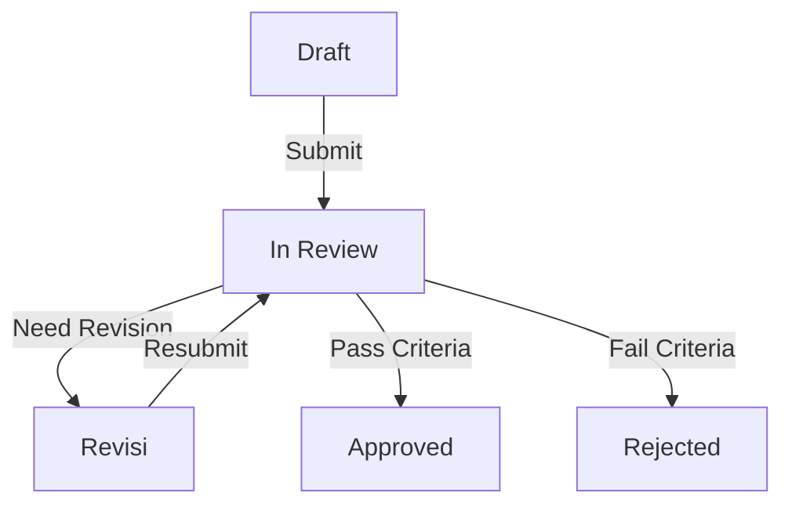

# PRISMA (Prioritizing Location) - ULOK Assessment System

## Overview

**PRISMA** is a Decision Support System (DSS) web application designed to evaluate and manage location proposals (_Usulan Lokasi_ / ULOK) for store expansions at **PT. Midi Utama Indonesia Tbk (Alfamidi)**.

The platform digitalizes legal document verification and automates location feasibility scoring using the **Simple Additive Weighting (SAW)** method.

---

## Key Features & Roles

### Role-Based Access Control (RBAC)

- **Branch Admin**: Submits location proposals, uploads legal documents, and updates data based on assessment feedback.
- **Legal Assessor**: Verifies submitted legal documents, manages approval queues, and determines proposal feasibility.
- **Super Admin**: Manages user accounts, system configuration, and branch assignments.

### Proposal Lifecycle


```mermaid
graph TD
    A[Draft] -->|Submit| B[In Review]
    B -->|Need Revision| C[Revisi]
    C -->|Resubmit| B
    B -->|Pass Criteria| D[Approved]
    B -->|Fail Criteria| E[Rejected]
```

- **Draft**: Initial proposal entry by Branch Admin.
- **In Review**: Active evaluation queue for Legal Assessors.
- **Revisi**: Proposal returned to Branch Admin for document updates or corrections.
- **Approved**: Verified legal completeness and calculated final SAW ranking score.
- **Rejected**: Proposal declined due to legal flaws or budget constraints.

---

## Decision Support Engine (SAW Method)

The system uses the **Simple Additive Weighting (SAW)** algorithm to generate automated feasibility rankings based on three main criteria:

| Code   | Criteria                    | Weight  |  Type   | Description                                                                                                 |
| :----- | :-------------------------- | :-----: | :-----: | :---------------------------------------------------------------------------------------------------------- |
| **C1** | Legal Document Completeness | **45%** | Benefit | Percentage of verified required legal documents based on entity type (_PT, Yayasan, Koperasi, Perorangan_). |
| **C2** | Processing Duration         | **35%** |  Cost   | Operational time (in days) from initial submission (`first_in_review_at`) to final approval.                |
| **C3** | Lease Cost Efficiency       | **20%** |  Cost   | Evaluation of the 5-year total lease value.                                                                 |

### Ranking Outputs

- **Final Score $\ge 0.75$**: Primary Recommendation (_Rekomendasi Utama_).
- **Final Score $< 0.75$**: Secondary Recommendation / Requires Review (_Perlu Evaluasi Lanjutan_).

---

## Tech Stack

- **Framework**: Next.js (React App Router, TypeScript)
- **Styling**: Tailwind CSS
- **Backend & Database**: Supabase (PostgreSQL, Supabase Auth, Storage Buckets)
- **Architecture**: Next.js Server Actions for secure database mutations
- **UI Components & Charts**: Lucide React, Recharts

---

## Database Architecture Overview

The database structure relies on PostgreSQL hosted on Supabase, designed with proper 1:1 and 1:N relations:

- **Core Access & Profiles**: `branches`, `profiles`
- **Proposal Core**: `ulok_submissions`
- **1:1 Entity Modules**:
  - Landowner Identity (`ulok_pemilik`)
  - Land Certificate Details (`ulok_sertifikat`)
  - Legal & AJB Documentation (`ulok_legal`)
  - Bank Guarantees (`ulok_jaminan`)
  - SAW Scores & Metrics (`metode_saw`)
- **Verification & Workflows**: `checklist_master`, `documents`, `comments`, `notifications`

---

## Setup & Configuration

### 1. Environment Variables

Create a `.env.local` file in the project root directory:

```env
NEXT_PUBLIC_SUPABASE_URL=your_supabase_project_url
NEXT_PUBLIC_SUPABASE_ANON_KEY=your_supabase_anon_key
SUPABASE_SERVICE_ROLE_KEY=your_supabase_service_role_key
```

### 2. Storage Buckets Setup

Ensure the following buckets exist in your Supabase project:

- `avatars`: Public bucket for profile avatars.
- `dokumen-ulok`: Secured bucket for uploaded legal PDF/image files.

### 3. Local Installation

```bash
# Install dependencies
pnpm install

# Run development server
pnpm run dev

# Build for production
pnpm run build

# Start production server
pnpm run start
```

---

## Deployment

This project is configured for deployment on Vercel. Ensure environment variables are set in the Vercel dashboard prior to deployment.
